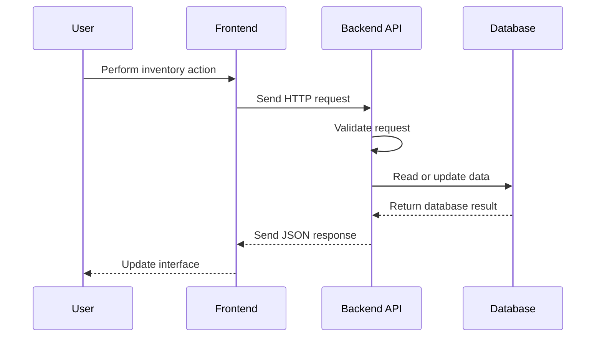

<div align="center">

# 📦 Inventory Management System — Backend

### Secure API service for products, stock, users, and inventory operations

<br>


<br><br>

<a href="https://github.com/romilleuva/inventory-management-system-backend">

</a>
<a href="https://github.com/romilleuva/inventory-management-system-backend">

</a>
<a href="https://github.com/romilleuva/inventory-management-system-backend">

</a>

<br><br>


</div>

---

## ⚡ Overview

This repository contains the backend API for the Inventory Management System.

It provides the server-side foundation for the frontend application, including data processing, inventory operations, API communication, and database integration.

Frontend repository:

[Inventory Management System Frontend](https://github.com/romilleuva/inventory-management-system-frontend)

> Update the feature list below to match the actual implementation.

---

## ✨ Features

| Feature | Status |
|---|---|
| 🔗 REST API | ✅ Available |
| 📦 Product management | ✅ Available |
| 📊 Inventory operations | ✅ Available |
| 🗄️ Database integration | ✅ Available |
| 🔐 Authentication | 🔄 Confirm in source code |
| 🛡️ Error handling | ✅ Available |
| 🌐 Frontend integration | ✅ Available |

---

## 🧬 System Architecture


---

## 🛠️ Technology Stack


<div align="center">


</div>

---

## 📁 Project Structure

```text
inventory-management-system-backend/
├── src/
│   ├── chatbot/
│   ├── config/
│   ├── controllers/
│   ├── middleware/
│   ├── models/
│   ├── routes/
|   └── utils
├── server.js
├── .env.example
├──.gitignore
├── package-lock.json
├── package.json
└── README.md
```

> Adjust this structure to match the actual repository.

---

## 🚀 Getting Started

### 1. Clone the repository

```bash
git clone [https://github.com/romilleuva/inventory-management-system-backend.git](https://github.com/romilleuva/inventory-management-system-backend.git)
cd inventory-management-system-backend
```

### 2. Install dependencies

For Node.js:

```bash
npm install
```

For Python:

```bash
pip install -r requirements.txt
```

Use only the command supported by your project.

### 3. Configure environment variables

Create a `.env` file:

```env
PORT=5000
DATABASE_URL=your_database_connection_string
JWT_SECRET=your_secret_key
FRONTEND_URL=http://localhost:3000
```

> Keep `.env` private and never commit secrets to GitHub.

### 4. Start the server

Node.js example:

```bash
npm run dev
```

Production example:

```bash
npm start
```

Python example:

```bash
python app.py
```

---

## 🔗 API Flow



---

## 📡 API Endpoints

> Replace these examples with the exact routes in the source code.

| Method | Endpoint | Purpose |
|---|---|---|
| `GET` | `/api/products` | Get products |
| `GET` | `/api/products/:id` | Get one product |
| `POST` | `/api/products` | Create a product |
| `PUT` | `/api/products/:id` | Update a product |
| `DELETE` | `/api/products/:id` | Delete a product |
| `GET` | `/api/inventory` | Get inventory data |

Example request:

```bash
curl http://localhost:5000/api/products
```

---

## 🔐 Environment Variables

| Variable | Purpose |
|---|---|
| `PORT` | Server port |
| `DATABASE_URL` | Database connection |
| `JWT_SECRET` | Authentication secret |
| `FRONTEND_URL` | Allowed frontend origin |

The exact variable names may differ in the implementation.

---

## 🧪 Testing

Run the project tests:

```bash
npm test
```

Or, for a Python project:

```bash
pytest
```

Test the health endpoint:

```bash
curl http://localhost:5000/health
```

---

## 🔒 Security Notes

- Store secrets in environment variables.
- Do not commit `.env` files.
- Validate incoming request data.
- Restrict CORS to trusted frontend origins.
- Use authentication for protected operations.
- Apply authorization checks to inventory actions.
- Use HTTPS in production.
- Do not expose database credentials in logs or responses.

---

## 🗺️ Roadmap


---

## 🤝 Contributing

1. Fork the repository.
2. Create a feature branch.
3. Implement your change.
4. Test the API locally.
5. Commit your changes.
6. Open a pull request.

```bash
git checkout -b feature/improvement
git commit -m "Improve inventory API"
git push origin feature/improvement
```

---

## 📄 License

Add the project license here.

---

<div align="center">

### POWERING BETTER INVENTORY MANAGEMENT

<a href="https://github.com/romilleuva/inventory-management-system-frontend">

</a>

<a href="https://github.com/romilleuva/inventory-management-system-backend">

</a>

<br><br>


</div>
